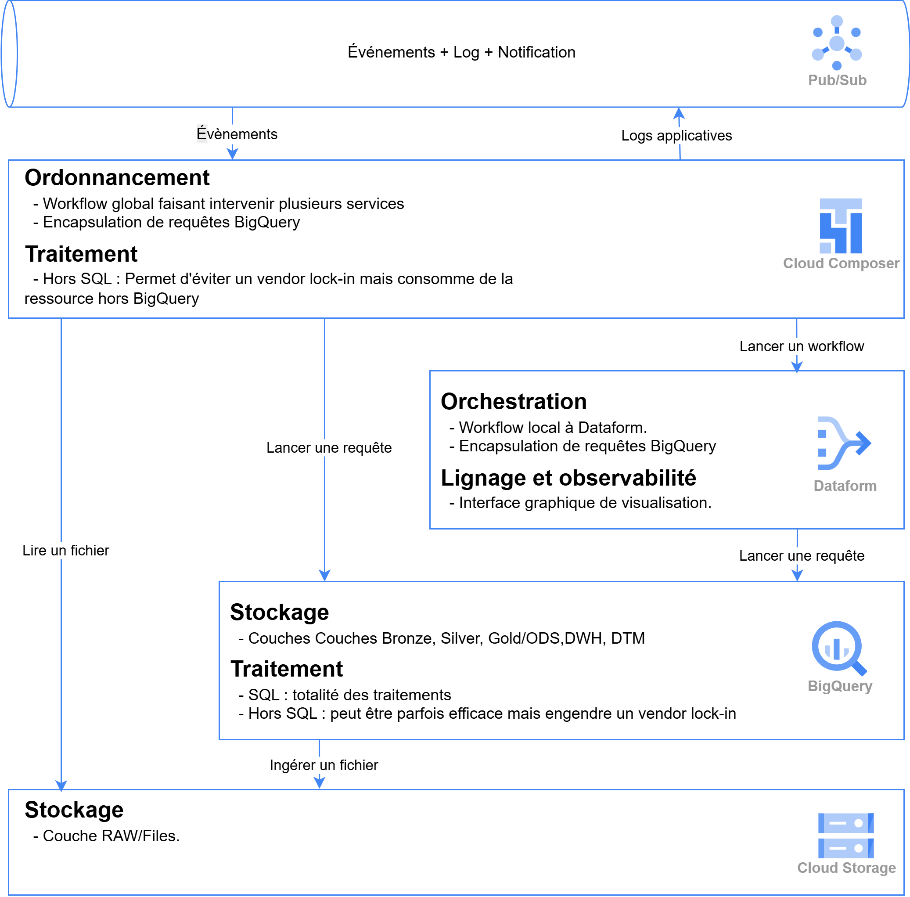

# Architecture Lakehouse Alimenté avec Fichiers

Cette documentation présente l'architecture et l'implémentation pratique du framework GCP Data Lakehouse pour l'alimentation de données par fichiers, basée sur l'architecture **médaillon étendue** avec 4 couches.

## Vue d'Ensemble Architecture



*Architecture générale du framework GCP Data Lakehouse avec l'approche médaillon étendue : **RAW → Bronze → Silver → Gold***

## Architecture Médaillon GCP Étendue

L'architecture suit le pattern **médaillon étendu** avec 4 couches, implémenté avec les services GCP :

### **Couche RAW** (Landing Zone)
- **Stockage** : Google Cloud Storage (bucket landing)
- **Rôle** : Zone d'atterrissage des fichiers sources externes
- **Formats** : Tous formats natifs (CSV, JSON, Parquet, XML, etc.)
- **Caractéristiques** :
  - Fichiers sources "as-is" depuis systèmes externes
  - Aucune transformation ni validation
  - Rétention temporaire (7-30 jours)
  - Point d'entrée unique pour toutes les sources

### **Couche BRONZE** (Données Historisées)
- **Stockage** : BigQuery tables avec métadonnées d'ingestion
- **Rôle** : Historisation complète avec traçabilité
- **Technologie** : Tables BigQuery partitionnées par date d'ingestion
- **Caractéristiques** :
  - Ingestion complète des données RAW dans BigQuery
  - **Métadonnées automatiques** : `ingestion_date`, `source_file`, `file_hash`
  - Historique immutable et auditable
  - Schéma flexible avec détection automatique
  - Partitioning par date pour performance

### **Couche SILVER** (Données Nettoyées)
- **Stockage** : BigQuery avec tables ou vues
- **Rôle** : Interface d'accès structuré et nettoyé aux données Bronze
- **Technologie** : Tables externes BigQuery ou vues sur Bronze
- **Caractéristiques** :
  - Transformation et nettoyage des données Bronze
  - Validation de qualité et conformité schéma
  - Déduplication et standardisation
  - Intégration native avec Dataform

### **Couche GOLD** (Données Business-Ready)
- **Stockage** : BigQuery avec tables matérialisées optimisées
- **Rôle** : Données enrichies, agrégées et prêtes pour l'analytique
- **Technologie** : Tables BigQuery optimisées avec SLA
- **Caractéristiques** :
  - Transformations métier et règles business
  - Agrégations et métriques calculées
  - Performance optimisée (clustering, partitioning)
  - Données certifiées pour le reporting

## Exemple Concret : Workflow Pattern 1 avec Cloud Composer


*Workflow détaillé d'ingestion CSV orchestré par Cloud Composer suivant l'architecture médaillon*

### Flux de Données Orchestré (4 Couches)

Le diagramme montre un **workflow Cloud Composer** complet adapté pour l'architecture 4-couches :

#### 1. **Vérification Landing Zone (RAW)**
- **Action** : "Vérifier que les fichiers sont disponibles"
- **Couche** : RAW (Cloud Storage landing)
- **Contrôles** : Présence fichiers, permissions, intégrité
- **Sortie** : Notification vers Pub/Sub en cas d'erreur

#### 2. **Contrôle Qualité Sources**
- **Action** : "Vérifier la qualité des fichiers (en-tête, séparateur...)"
- **Couche** : Validation RAW avant ingestion
- **Contrôles** : Headers, délimiteurs, encodage, taille, format
- **Sortie** : Logs applicatifs vers monitoring

#### 3. **Ingestion Bronze avec Métadonnées**
- **Action** : "Ingérer les fichiers RAW vers Bronze BigQuery"
- **Source** : Cloud Storage (RAW)
- **Destination** : BigQuery tables Bronze avec métadonnées
- **Transformations** :
  - Ajout `ingestion_date TIMESTAMP DEFAULT CURRENT_TIMESTAMP()`
  - Ajout `source_file STRING` (chemin complet)
  - Ajout `file_hash STRING` (pour déduplication)
  - Ajout `batch_id STRING` (pour traçabilité)
- **Partitioning** : Par `ingestion_date` pour performance

#### 4. **Nettoyage Silver depuis Bronze**
- **Action** : "Nettoyage et structuration (Silver)"
- **Source** : Tables Bronze BigQuery
- **Orchestration** : Workflow DQ (Data Quality) via Dataform
- **Transformations** : Déduplication, validation, typage
- **Résultat** : Tables/vues Silver dans BigQuery

#### 5. **Transformation Gold Business**
- **Action** : "Transformations et alimentation modèle Business (Gold)"
- **Source** : Tables Silver BigQuery
- **Orchestration** : Workflow MOM (Master Object Model) via Dataform
- **Transformations** : Enrichissement, agrégations, règles métier
- **Résultat** : Tables Gold optimisées prêtes pour analytics

### Services GCP Impliqués

**Cloud Composer (Orchestration)**
- Workflow global séquentiel
- Gestion des dépendances entre étapes
- Retry et gestion d'erreurs
- Scheduling et monitoring

**Dataform (ELT Processing)**
- Workflow DQ pour la couche Silver
- Workflow MOM pour la couche Gold
- Gestion du lineage des transformations
- Interface graphique de visualisation

**BigQuery (Processing & Storage)**
- Requêtes d'ingestion (Bronze → Silver)
- Requêtes DQ (Data Quality)
- Requêtes Transfo/Alim (Silver → Gold)
- Tables externes et matérialisées

**Cloud Storage (Data Lake)**
- Couche Bronze : Stockage brut
- Stockage des fichiers sources
- Intégration native avec BigQuery

**Pub/Sub (Events & Monitoring)**
- Événements + Logs + Notifications
- Monitoring en temps réel
- Alerting en cas d'échec

## Avantages de l'Architecture Médaillon GCP

### **Performance et Scalabilité**
- **Architecture médaillon éprouvée** : Standard industrie pour les data lakes
- **Full BigQuery** : Traitement natif sans infrastructure externe
- **Transformations internes** : Flux Bronze → Silver → Gold entièrement dans BigQuery
- **Optimisations automatiques** : Partitioning, clustering, compression BigQuery

### **Observabilité et Gouvernance**
- **Lineage complet** : Traçabilité Bronze → Silver → Gold via Dataform
- **Monitoring applicatif intégré** : Pub/Sub pour événements et notifications
- **Workflows visuels** : Orchestration exploitants (Airflow) et logique data (Dataform)
- **Logs centralisés** : Tous les traitements tracés dans GCP

### **Flexibilité et Maintenabilité**
- **Séparation des responsabilités** : Chaque couche a un rôle précis
- **Workflows orchestrés** : Cloud Composer pour gestion complexe
- **Pattern reproductible** : Template réutilisable pour nouveaux cas d'usage
- **Évolutivité** : Ajout de nouvelles transformations facilité

## Cas d'Usage Supportés par l'Architecture

### **Volumes de Données Testés**
- **5MB** : Tests et développement, prototypage rapide
- **1GB** : Datasets moyens, analytics départementaux
- **5GB** : Volumes importants, production entreprise
- **>5GB** : Architecture scalable, splitting automatique possible

### **Formats Sources (Couche Bronze)**
- **CSV** : Délimiteurs configurables (`;`, `,`, `|`, `\t`)
- **JSON** : Structures imbriquées, arrays, objets complexes
- **Parquet** : Format optimisé pour analytics, compression native
- **Avro** : Schemas évolutifs, intégration Kafka/Pub/Sub
- **Multi-formats** : Support simultané dans le même pipeline

### **Patterns Temporels d'Ingestion**
- **Batch quotidien** : Standard pour la plupart des cas d'usage
- **Intraday** : Plusieurs exécutions par jour (H+2, H+6, etc.)
- **Near real-time** : Déclenchement par événements GCS via Cloud Functions
- **Micro-batch** : Traitement par petits lots avec Dataform scheduling

## Évolutions et Patterns Avancés

### **Pattern 1 Actuel : Ingestion CSV Médaillon**
- **Implémenté** : Workflow Cloud Composer complet
- **RAW** : Cloud Storage landing zone temporaire
- **Bronze** : BigQuery avec métadonnées d'ingestion
- **Silver** : BigQuery tables nettoyées et validées
- **Gold** : BigQuery tables matérialisées business-ready
- **Orchestration** : Dataform pour DQ et transformations

### **Pattern 2 : Multi-Sources Enterprise**
- **Sources diverses** : APIs REST, bases relationnelles, SaaS
- **Connecteurs natifs** : Salesforce, SAP, Oracle via Cloud Data Fusion
- **CDC** : Change Data Capture pour réplication temps réel
- **Unified Bronze** : Consolidation multi-sources dans GCS

### **Pattern 3 : Streaming Temps Réel**
- **Ingestion** : Cloud Pub/Sub → Dataflow → BigQuery
- **Architecture** : Lambda avec batch et streaming
- **Use cases** : IoT, logs applicatifs, événements business
- **Fenêtrage** : Agrégations temps réel avec Apache Beam

### **Pattern 4 : Data Mesh et Fédération**
- **Domaines métier** : Datasets séparés par domain
- **Gouvernance décentralisée** : Équipes propriétaires de leurs données
- **APIs data** : Exposition via BigQuery views et Data Catalog
- **Cross-domain** : Lineage et discovery centralisés

## Correspondance avec le Framework de Référence

Cette architecture médaillon **étendue 4-couches** correspond à l'implémentation GCP avancée du framework de référence :

| **Médaillon** | **Framework** | **Technologie GCP** | **Rôle** |
|---------------|---------------|---------------------|----------|
| **RAW** | **Landing Zone** | Cloud Storage (temporaire) | Landing zone fichiers sources |
| **Bronze** | **RAW étendu** | BigQuery + Métadonnées | Historisation avec traçabilité |
| **Silver** | **Cleaned Data** | BigQuery Tables/Vues | Nettoyage et structuration |
| **Gold** | **Business Data** | BigQuery Tables Matérialisées | Analytics-ready, enrichi |

### **Nouvelles Métadonnées Bronze Obligatoires**

```sql
-- Schema Bronze type avec métadonnées d'ingestion
CREATE TABLE `bronze_schema.employees` (
  -- Colonnes métier (données sources)
  id INT64,
  nom STRING,
  prenom STRING,
  -- ... autres colonnes métier

  -- Métadonnées d'ingestion (OBLIGATOIRES)
  ingestion_date TIMESTAMP DEFAULT CURRENT_TIMESTAMP(),
  source_file STRING,
  file_hash STRING,
  batch_id STRING,
  raw_data STRING  -- JSON des données brutes si besoin
)
PARTITION BY DATE(ingestion_date)
CLUSTER BY source_file;
```

### **Conformité Framework Stricte**

Cette documentation respecte intégralement les standards définis dans [`framework.md`](../framework.md) :

- **Stack technique GCP** : 100% services Google Cloud Platform
- **Architecture 4-couches** : RAW → Bronze → Silver → Gold
- **Conventions médaillon** : Nomenclature standardisée par couche
- **Métadonnées obligatoires** : `ingestion_date`, `source_file`, `file_hash`, `batch_id`
- **Orchestration Dataform** : ELT natif avec lineage et observabilité
- **Patterns évolutifs** : Extension vers streaming et multi-sources possible
- **Traçabilité complète** : Du fichier source aux données business

L'architecture médaillon apporte une **standardisation industrie** tout en respectant les **principes du framework GCP** pour garantir cohérence et évolutivité.