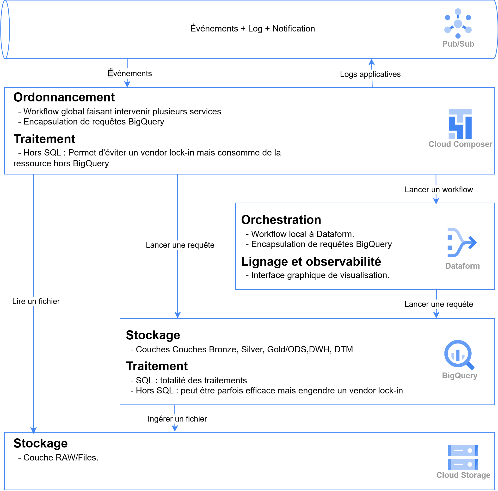
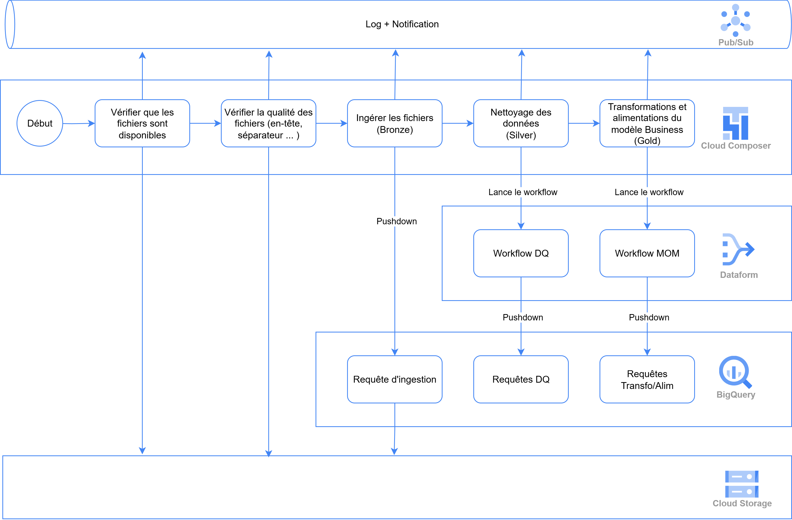

# Cas d'Usage : Alimentation Lakehouse Conséquent

Cette documentation présente l'architecture et l'implémentation pratique du framework GCP Data Lakehouse pour des cas d'usage d'alimentation de données conséquents, basée sur l'architecture **médaillon** (Medallion Architecture).

## Vue d'Ensemble Architecture

*Architecture générale du framework GCP Data Lakehouse avec l'approche médaillon : **Bronze → Silver → Gold***

## Architecture Médaillon GCP

L'architecture suit le pattern **médaillon** reconnu dans l'industrie, implémenté avec les services GCP :

### 🥉 **Couche BRONZE** (Données Brutes)
- **Stockage** : Google Cloud Storage
- **Rôle** : Stockage des fichiers bruts sans transformation
- **Formats** : CSV, JSON, Parquet, autres formats natifs
- **Caractéristiques** :
  - Données "as-is" depuis les sources
  - Historique complet et immutable
  - Stockage économique et scalable
  - Durabilité et disponibilité élevées

### 🥈 **Couche SILVER** (Données Nettoyées)
- **Stockage** : BigQuery avec tables externes (01_STG)
- **Rôle** : Interface d'accès structuré aux données Bronze
- **Technologie** : Tables externes BigQuery pointant vers GCS
- **Caractéristiques** :
  - Accès SQL direct aux fichiers Bronze
  - Pas de duplication de données
  - Schémas typés et validés
  - Intégration native avec Dataform

### 🥇 **Couche GOLD** (Données Business-Ready)
- **Stockage** : BigQuery avec tables matérialisées (02_ODS)
- **Rôle** : Données enrichies, agrégées et prêtes pour l'analytique
- **Technologie** : Tables BigQuery optimisées
- **Caractéristiques** :
  - Transformations métier appliquées
  - Métadonnées d'ingestion automatiques
  - Performance optimisée pour les requêtes
  - Données de confiance pour le reporting

## Exemple Concret : Workflow Pattern 1 avec Cloud Composer

*Workflow détaillé d'ingestion CSV orchestré par Cloud Composer suivant l'architecture médaillon*

### Flux de Données Orchestré

Le diagramme montre un **workflow Cloud Composer** complet avec 5 étapes séquentielles :

#### 1. **Vérification de Disponibilité**
- **Action** : "Vérifier que les fichiers sont disponibles"
- **Rôle** : Validation de la présence des fichiers sources
- **Sortie** : Notification vers Pub/Sub en cas d'erreur

#### 2. **Contrôle Qualité Sources**
- **Action** : "Vérifier la qualité des fichiers (en-tête, séparateur...)"
- **Rôle** : Validation du format et de la structure
- **Contrôles** : Headers, délimiteurs, encodage, taille
- **Sortie** : Logs applicatifs vers monitoring

#### 3. **Ingestion Bronze**
- **Action** : "Ingérer les fichiers (Bronze)"
- **Destination** : Cloud Storage (couche Bronze)
- **Rôle** : Stockage brut des données "as-is"
- **Déclencheur** : Pushdown vers Silver

#### 4. **Nettoyage Silver**
- **Action** : "Nettoyage des données (Silver)"
- **Orchestration** : Workflow DQ (Data Quality) via Dataform
- **Rôle** : Validation, typage, nettoyage
- **Résultat** : Requêtes DQ dans BigQuery

#### 5. **Transformation Gold**
- **Action** : "Transformations et alimentation du modèle Business (Gold)"
- **Orchestration** : Workflow MOM (Master Object Model) via Dataform
- **Rôle** : Enrichissement, agrégations, règles métier
- **Résultat** : Requêtes Transfo/Alim dans BigQuery

### Services GCP Impliqués

**🎼 Cloud Composer (Orchestration)**
- Workflow global séquentiel
- Gestion des dépendances entre étapes
- Retry et gestion d'erreurs
- Scheduling et monitoring

**📊 Dataform (ELT Processing)**
- Workflow DQ pour la couche Silver
- Workflow MOM pour la couche Gold
- Gestion du lineage des transformations
- Interface graphique de visualisation

**🗄️ BigQuery (Processing & Storage)**
- Requêtes d'ingestion (Bronze → Silver)
- Requêtes DQ (Data Quality)
- Requêtes Transfo/Alim (Silver → Gold)
- Tables externes et matérialisées

**☁️ Cloud Storage (Data Lake)**
- Couche Bronze : Stockage brut
- Stockage des fichiers sources
- Intégration native avec BigQuery

**📡 Pub/Sub (Events & Monitoring)**
- Événements + Logs + Notifications
- Monitoring en temps réel
- Alerting en cas d'échec

## Avantages de l'Architecture Médaillon GCP

### 🚀 **Performance et Scalabilité**
- **Architecture médaillon éprouvée** : Standard industrie pour les data lakes
- **Full BigQuery** : Traitement natif sans infrastructure externe
- **Tables externes** : Accès direct Bronze → Silver sans duplication
- **Optimisations automatiques** : Partitioning, clustering, compression BigQuery

### 🔍 **Observabilité et Gouvernance**
- **Lineage complet** : Traçabilité Bronze → Silver → Gold via Dataform
- **Monitoring intégré** : Pub/Sub pour événements et notifications
- **Workflows visuels** : Interface Dataform pour visualisation des dépendances
- **Logs centralisés** : Tous les traitements tracés dans GCP

### 🔧 **Flexibilité et Maintenabilité**
- **Séparation des responsabilités** : Chaque couche a un rôle précis
- **Workflows orchestrés** : Cloud Composer pour gestion complexe
- **Pattern reproductible** : Template réutilisable pour nouveaux cas d'usage
- **Évolutivité** : Ajout de nouvelles transformations facilité

## Cas d'Usage Supportés par l'Architecture

### 📊 **Volumes de Données Testés**
- ✅ **5MB** : Tests et développement, prototypage rapide
- ✅ **1GB** : Datasets moyens, analytics départementaux
- ✅ **5GB** : Volumes conséquents, production entreprise
- ✅ **>5GB** : Architecture scalable, splitting automatique possible

### 📁 **Formats Sources (Couche Bronze)**
- **CSV** : Délimiteurs configurables (`;`, `,`, `|`, `\t`)
- **JSON** : Structures imbriquées, arrays, objets complexes
- **Parquet** : Format optimisé pour analytics, compression native
- **Avro** : Schemas évolutifs, intégration Kafka/Pub/Sub
- **Multi-formats** : Support simultané dans le même pipeline

### ⏰ **Patterns Temporels d'Ingestion**
- **Batch quotidien** : Standard pour la plupart des cas d'usage
- **Intraday** : Plusieurs exécutions par jour (H+2, H+6, etc.)
- **Near real-time** : Déclenchement par événements GCS via Cloud Functions
- **Micro-batch** : Traitement par petits lots avec Dataform scheduling

## Évolutions et Patterns Avancés

### 🎯 **Pattern 1 Actuel : Ingestion CSV Médaillon**
- ✅ **Implémenté** : Workflow Cloud Composer complet
- ✅ **Bronze** : Cloud Storage avec fichiers bruts
- ✅ **Silver** : BigQuery tables externes (01_STG)
- ✅ **Gold** : BigQuery tables matérialisées (02_ODS)
- ✅ **Orchestration** : Dataform pour DQ et transformations

### 🚀 **Pattern 2 : Multi-Sources Enterprise**
- **Sources diverses** : APIs REST, bases relationnelles, SaaS
- **Connecteurs natifs** : Salesforce, SAP, Oracle via Cloud Data Fusion
- **CDC** : Change Data Capture pour réplication temps réel
- **Unified Bronze** : Consolidation multi-sources dans GCS

### ⚡ **Pattern 3 : Streaming Temps Réel**
- **Ingestion** : Cloud Pub/Sub → Dataflow → BigQuery
- **Architecture** : Lambda avec batch et streaming
- **Use cases** : IoT, logs applicatifs, événements business
- **Fenêtrage** : Agrégations temps réel avec Apache Beam

### 🌐 **Pattern 4 : Data Mesh et Fédération**
- **Domaines métier** : Datasets séparés par domain
- **Gouvernance décentralisée** : Équipes propriétaires de leurs données
- **APIs data** : Exposition via BigQuery views et Data Catalog
- **Cross-domain** : Lineage et discovery centralisés

## Correspondance avec le Framework de Référence

Cette architecture médaillon **Bronze → Silver → Gold** correspond à l'implémentation GCP du framework de référence :

| **Médaillon** | **Framework** | **Technologie GCP** | **Rôle** |
|---------------|---------------|---------------------|----------|
| 🥉 **Bronze** | **RAW** | Cloud Storage | Fichiers bruts "as-is" |
| 🥈 **Silver** | **STG (01_STG)** | BigQuery Tables Externes | Accès structuré, validation |
| 🥇 **Gold** | **ODS (02_ODS)** | BigQuery Tables Matérialisées | Analytics-ready, enrichi |

### ✅ **Conformité Framework Stricte**

Cette documentation respecte intégralement les standards définis dans [`framework.md`](../framework.md) :

- ✅ **Stack technique GCP** : 100% services Google Cloud Platform
- ✅ **Architecture 3-couches** : Bronze/RAW → Silver/STG → Gold/ODS
- ✅ **Conventions de nommage** : `01_STG.{entity}` et `02_ODS.{entity}`
- ✅ **Templates employees** : Référence pour tous nouveaux cas d'usage
- ✅ **Métadonnées obligatoires** : `ingestion_date` et `source_file` en Gold/ODS
- ✅ **Orchestration Dataform** : ELT natif avec lineage et observabilité
- ✅ **Patterns évolutifs** : Extension vers streaming et multi-sources possible

L'architecture médaillon apporte une **standardisation industrie** tout en respectant le **framework GCP défini** pour garantir cohérence et évolutivité.